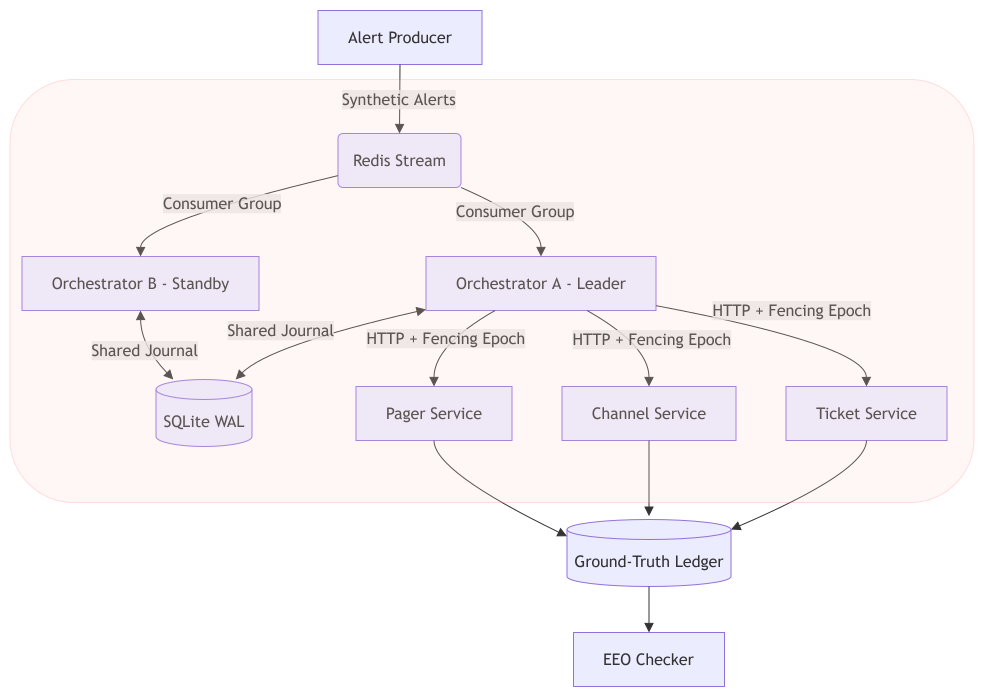

# PALIMPSEST — Design Document

**Divergence-safe durable execution for agent decisioning.**
When recovery replays a *judgement* rather than a computation, the durability
guarantee becomes the bug.

---

## 1. The problem

An agent classifies an incident, acts on it, and the action fails *because the
classification was wrong*. Both conventional recoveries are wrong:

| Strategy | Result |
| --- | --- |
| **Pinned replay** — what durable execution guarantees | replays the wrong decision forever. **Nobody is paged.** |
| **Naive re-run** | right answer, but the first attempt's effects still stand — **duplicate ticket, duplicate post, an unexplained second phone call** |

PALIMPSEST forks the journal at the decision, holds the irreversible action behind a
barrier, proves the abandoned branch was cleaned up, then acts once.

---

## 2. Architecture

| Port | Process | Role |
| --- | --- | --- |
| 8100 | ledger | ground truth — **the oracle** |
| 8101 / 8102 | ticket / channel | reversible, observable |
| 8103 | pager | **irreversible + unobservable** |
| 6379 / 8000 | redis / dashboard | alert stream (optional) · read-only UI |

**Nothing grades itself.** The orchestrator acts, the ledger records what actually
happened, the checker compares them — in separate processes.

---

## 3. Design decisions

| # | Decision | Why |
| --- | --- | --- |
| **D1** | The journal is a **tree, not a log** | Recovery forks and marks the old branch abandoned instead of rewriting history. The rejected decision stays readable — which is what makes cleanup *provable*. |
| **D2** | Tools typed by **effect**, not by name | `pure/idempotent/compensatable/irreversible` × `observable/unobservable`. Recovery becomes decidable: probe what's observable, undo what's compensatable, escalate what is neither. |
| **D3** | The irreversible barrier is **workflow-scoped and bounded** | No branch acts irreversibly while *any* abandoned branch holds uncompensated effects — sibling scope would miss an "aunt". Compensation retries to a deadline, then escalates with the branch tree. |
| **D4** | Idempotency and fencing are **separate** | The key (`workflow+branch+seq`) is stable across epochs — if it changed on failover, every leader change would duplicate every effect. Fencing is a per-workflow epoch enforced *at the service* (HTTP 409). |
| **D5** | **`unknown` is first-class** | A read timeout may well have committed; a refused connection never left the machine. Collapsing them invents escalations from a closed port, or silently double-pages. |
| **D6** | One `World` Protocol, **two implementations** | `InProcessWorld` and `HttpWorld` swap on a flag. Identical semantics are what make the in-process model trustworthy. |
| **D7** | At-least-once delivery is **absorbed** | `workflow_id` derives from the alert id, so a redelivered alert lands on the same workflow. |

Two terminal states only: **acted with proof of cleanup**, or **escalated with a full
account**.

---

## 4. Correctness — Effect-Exactly-Once

Graded against the out-of-process ledger after crash, recovery and quiescence:

1. **No duplication** — no irreversible effect twice per decision point; a second is
   legitimate only if it carries a supersede annotation naming the first.
2. **No loss** — every workflow ends in a committed action or a surfaced escalation.
3. **Clean abandonment** — abandoned-branch effects compensated in reverse order.

A clause-3 shortfall named by an escalation record is *explained*; only
**unexplained** violations count.

> EEO is a **safety** property, not liveness. Refusing to act against a broken world
> and saying so duplicates nothing and loses nothing — which is why the escalation rate
> is reported beside the verdict. A verdict alone goes green against a dead effect layer.

---

## 5. Scenario analysis

| Scenario | Stresses | pinned | naive | **palimpsest** |
| --- | --- | --- | --- | --- |
| **poison** | wrong class, page fails | 1/1/0 livelocked · FAIL | 2/2/1 · FAIL | **1/1/1 · PASS** |
| **residue** | wrong page already rang | 1/1/1 commits error · PASS | 2/2/2 double buzz · FAIL | **1/1/2 · PASS** — supersedes |
| **compfail** | cleanup dies permanently | livelocked · FAIL | 2/2/1 · FAIL | **escalates · PASS** |
| **compretry** | same outage, transient | livelocked · FAIL | 2/2/1 · FAIL | **1/1/1 · PASS** |
| **zombie** | page times out, lands late | escalates · PASS | escalates · PASS | **escalates · PASS** |
| **crash** | 4 step boundaries | — | — | **no boundary duplicates** |
| **redelivery** | same alert twice | — | — | **one workflow** |

**The two that decide the design.** In `residue` palimpsest ends at *two* pages and
still passes: the first cannot be un-rung, so it is recorded as residue and the second
names it — a second ring is fine **when it explains the first**. In `compfail` it pages
*nobody* and still passes, having refused to act blind. Note `pinned` **passes**
`residue` while paging the wrong rota: EEO is a claim about effects, not judgement.

---

## 6. Evidence

`demo.py --sweep` — every step boundary × branch state × 3 fault modes:
**51 runs · clauses 51/51 · 51/51 · 51/51 · escalation rate 33.3 % · unexplained
violations 0.** By mode: `crash` **0 %**, `partition` **100 %** by construction,
`partition-transient` **0 %**; none ever duplicates. Plus 24 invariant tests, 20 smoke
checks over real sockets, and `verify.bat`.

---

## 7. Where it falls over

- **Exactly-once for irreversible + unobservable effects is impossible** (two
  generals). We bound the ambiguity to one place and surface it.
- **Compensation restores state, not history** — a deleted post was still seen. Agent
  decisions are scripted, failover is single-host, and the sweep's crashes are
  in-process, so a real orchestrator kill stays a manual step.
